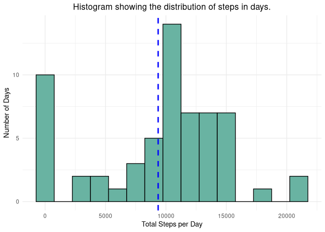
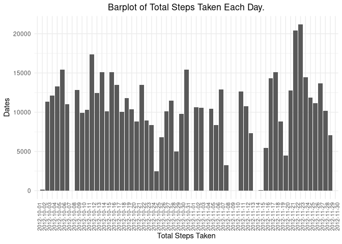
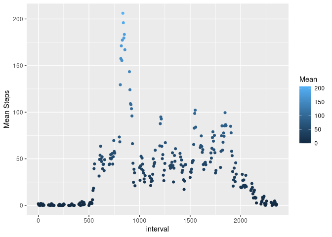
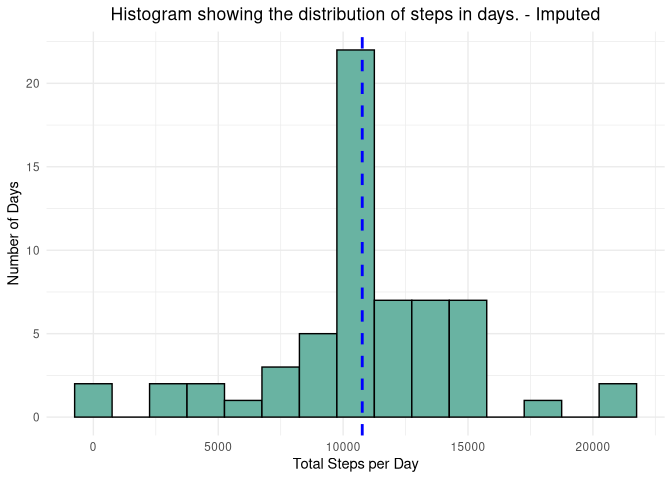
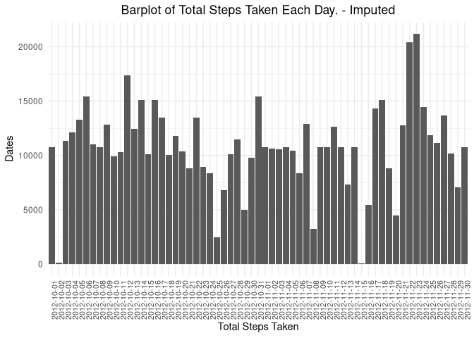
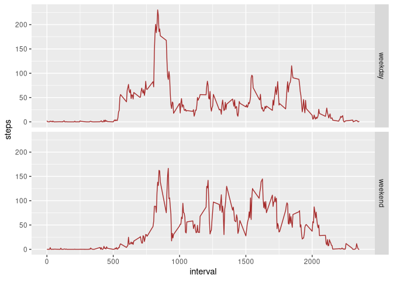

The Quantified Self Assignment
==============================

It is now possible to collect a large amount of data about personal
movement using activity monitoring devices such as a
[Fitbit](https://www.fitbit.com/ "Fitbit"), [Nike
Fuelband](https://www.nike.com/us/en_us/c/nikeplus-fuelband "Nike Fuelband"),
or [Jawbone Up](https://jawbone.com/up "Jawbone Up"). These type of
devices are part of the “quantified self” movement – a group of
enthusiasts who take measurements about themselves regularly to improve
their health, to find patterns in their behavior, or because they are
tech geeks. But these data remain under-utilized both because the raw
data are hard to obtain and there is a lack of statistical methods and
software for processing and interpreting the data.

This assignment makes use of data from a personal activity monitoring
device. This device collects data at 5 minute intervals through out the
day. The data consists of two months of data from an anonymous
individual collected during the months of October and November, 2012 and
include the number of steps taken in 5 minute intervals each day.

Source of the Data
------------------

The data for the assignment was downloaded from the [course
website](https://www.coursera.org/learn/reproducible-research/peer/gYyPt/course-project-1 "course website"):

[Dataset](https://d396qusza40orc.cloudfront.net/repdata%2Fdata%2Factivity.zip "Dataset")

The variables included in the dataset are:

-   **steps:** Number of steps taking in a 5-minute interval (missing
    values are coded as NA)

-   **date:** The date on which the measurement was taken in YYYY-MM-DD
    format

-   **interval:** Identifier for the 5-minute interval in which
    measurement was taken

Loading and Preprocessing the data
----------------------------------

Considering that this document is for training purposes I will use
“Tidyverse” libraries as I am trying to get fluent with them. Also I
like tibbles.

    require("tidyverse")
    activity <- as_tibble(read_csv(unz("activity.zip","activity.csv")))

### Exploring the dataset

First a brief look at the dataset components, then get a summary and
finally let’s see what’s inside.

    str(activity)

    ## tibble [17,568 × 3] (S3: tbl_df/tbl/data.frame)
    ##  $ steps   : num [1:17568] NA NA NA NA NA NA NA NA NA NA ...
    ##  $ date    : Date[1:17568], format: "2012-10-01" "2012-10-01" ...
    ##  $ interval: num [1:17568] 0 5 10 15 20 25 30 35 40 45 ...
    ##  - attr(*, "spec")=
    ##   .. cols(
    ##   ..   steps = col_double(),
    ##   ..   date = col_date(format = ""),
    ##   ..   interval = col_double()
    ##   .. )

    summary(activity)

    ##      steps             date               interval     
    ##  Min.   :  0.00   Min.   :2012-10-01   Min.   :   0.0  
    ##  1st Qu.:  0.00   1st Qu.:2012-10-16   1st Qu.: 588.8  
    ##  Median :  0.00   Median :2012-10-31   Median :1177.5  
    ##  Mean   : 37.38   Mean   :2012-10-31   Mean   :1177.5  
    ##  3rd Qu.: 12.00   3rd Qu.:2012-11-15   3rd Qu.:1766.2  
    ##  Max.   :806.00   Max.   :2012-11-30   Max.   :2355.0  
    ##  NA's   :2304

### Processing the Data

#### 1. Question. What is mean total number of steps taken per day?

-   What is mean total number of steps taken per day?
    -   Calculate and report Mean and Median for each day as well as
        total steps.
    -   Make a histogram of total number of steps taken each day.

To answer this I will first group the tibble by date. This will allow me
to use the summarise function to calculate the means, median and sums
and prepare a summary table accordingly.

    dailySteps <- activity %>% group_by(date) %>%
        summarise(Totals = sum(steps, na.rm = T), Mean = mean(steps, na.rm = T),
                  Median = median(steps,na.rm = T))

A histogram will show the count or the frequency of the data hence a
distribution. However the question requires that the data is plotted
categorically. Thus a barplot.

    g <- ggplot(dailySteps, aes(x = Totals))
    f <- ggplot(dailySteps, aes(x = as.factor(date), y = Totals))
    histA <- g + geom_histogram(binwidth = 1500, colour="black", fill="#69b3a2") + 
        ggtitle("Histogram showing the distribution of steps in days.") +
        xlab("Total Steps per Day") + ylab("Number of Days") +
        theme_minimal() + geom_vline(aes(xintercept=mean(Totals)),
                color="blue", linetype="dashed", size=1) +
        theme(plot.title = element_text(hjust = .5))
    histA
    barA <- f + geom_bar(stat = "identity") + theme_minimal() + 
        theme(axis.text.x = element_text(angle = 90, size = 8 ),
              plot.title = element_text(hjust = .5)) + 
        labs(title = "Barplot of Total Steps Taken Each Day.",
             x="Total Steps Taken", y = "Dates") 
    barA

Totals, Mean and Median information for each day.

    dailySteps

    ## # A tibble: 61 x 4
    ##    date       Totals    Mean Median
    ##    <date>      <dbl>   <dbl>  <dbl>
    ##  1 2012-10-01      0 NaN         NA
    ##  2 2012-10-02    126   0.438      0
    ##  3 2012-10-03  11352  39.4        0
    ##  4 2012-10-04  12116  42.1        0
    ##  5 2012-10-05  13294  46.2        0
    ##  6 2012-10-06  15420  53.5        0
    ##  7 2012-10-07  11015  38.2        0
    ##  8 2012-10-08      0 NaN         NA
    ##  9 2012-10-09  12811  44.5        0
    ## 10 2012-10-10   9900  34.4        0
    ## # … with 51 more rows

#### 2. Question. What is the average daily activity pattern?

-   What is the average daily activity pattern?
    -   Make a time series plot (i.e. type =
        “l”) of the 5-minute interval (x-axis) and the average
        number of steps taken, averaged across all days (y-axis)
    -   Which 5-minute interval, on average across all the days in the
        dataset, contains the maximum number of steps?

I will use ggplot and the summarise function once again.

    iactive <- group_by(activity, interval)
    sumTable <- summarise(iactive,Mean = mean(steps,na.rm = T),
                   Steps = sum(steps,na.rm = T),
                   Median = median(steps, na.rm = T),
                   tMean = mean(activity$steps, na.rm = T))
    t <- ggplot(sumTable, aes(interval,Mean)) 
    t + geom_point(aes(colour = Mean)) + ylab("Mean Steps")

        scale_x_continuous(name = "Interval", breaks = seq(0,2500,250))

    ## <ScaleContinuousPosition>
    ##  Range:  
    ##  Limits:    0 --    1

Answer for the second part of the question :

    maxInt <- sumTable[sumTable$Mean==max(sumTable$Mean),]$interval
    maxInt

    ## [1] 835

The 5-minute interval, on average across all the days in the dataset,
containing the maximum number of steps is **835**

### 3. Question. Imputing missing values.

-   Note that there are a number of days/intervals where there are
    missing values (coded as NA). The presence of missing days may
    introduce bias into some calculations or summaries of the data.
    -   Calculate and report the total number of missing values in the
        dataset (i.e. the total number of rows with NAs)
    -   Devise a strategy for filling in all of the missing values in
        the dataset.
    -   Create a new dataset that is equal to the original dataset but
        with the missing data filled in.
    -   Make a histogram of the total number of steps taken each day and
        Calculate and report the mean and median total number of steps
        taken per day. Do these values differ from the estimates from
        the first part of the assignment? What is the impact of imputing
        missing data on the estimates of the total daily number of
        steps?

Although the summaries we made at the beginning state the number of NA
values, we can calculate them easily as such :

    # number of NA's
    sum(is.na(activity$steps))

    ## [1] 2304

The missing values of steps can only be filled with integers as one
can’t take quarter of a step. So I will round the median value for the
interval the missing value belongs to and fill accordingly. Initially I
replicated the activity data. Then I extracted the indexes of the
missing values. After that I *joined* the the replicated data to the
summary table I prepared above, on *interval* variable, to bring in the
*mean* value of the interval for each observation. Finally I updated all
missing values with the rounded mean values of the interval.

    repData <- activity
    missInd <- which(is.na(repData$steps))
    repData <- left_join(repData,sumTable[,1:2],by = "interval")
    repData[missInd,]$steps <- round(repData[missInd,]$Mean)
    repData <- select(repData, -Mean)
    repData

    ## # A tibble: 17,568 x 3
    ##    steps date       interval
    ##    <dbl> <date>        <dbl>
    ##  1     2 2012-10-01        0
    ##  2     0 2012-10-01        5
    ##  3     0 2012-10-01       10
    ##  4     0 2012-10-01       15
    ##  5     0 2012-10-01       20
    ##  6     2 2012-10-01       25
    ##  7     1 2012-10-01       30
    ##  8     1 2012-10-01       35
    ##  9     0 2012-10-01       40
    ## 10     1 2012-10-01       45
    ## # … with 17,558 more rows

Variables using the filled dataset will have the prefix **f**.

    # Preparing the daily steps set
    fdailySteps <- repData %>% group_by(date) %>%
        summarise(Totals = sum(steps, na.rm = T), Mean = mean(steps, na.rm = T),
                  Median = median(steps,na.rm = T))
    # The charts
    fg <- ggplot(fdailySteps, aes(x = Totals))
    ff <- ggplot(fdailySteps, aes(x = as.factor(date), y = Totals))
    histB <- fg + geom_histogram(binwidth = 1500, colour="black", fill="#69b3a2") + 
        ggtitle("Histogram showing the distribution of steps in days. - Imputed") +
        xlab("Total Steps per Day") + ylab("Number of Days") +
        theme_minimal() + geom_vline(aes(xintercept=mean(Totals)),
                color="blue", linetype="dashed", size=1) +
        theme(plot.title = element_text(hjust = .5))
    histB
    barB <- ff + geom_bar(stat = "identity") + theme_minimal() + 
        theme(axis.text.x = element_text(angle = 90, size = 8 ),
              plot.title = element_text(hjust = .5)) + 
        labs(title = "Barplot of Total Steps Taken Each Day. - Imputed",
             x="Total Steps Taken", y = "Dates") 
    barB

Totals, Mean and Median information for each day. The change in
distribution shows that we have eliminated the outlier yet no major
disruption has occurred.

    histA
    histB
    barA
    barB
    fdailySteps

    ## # A tibble: 61 x 4
    ##    date       Totals   Mean Median
    ##    <date>      <dbl>  <dbl>  <dbl>
    ##  1 2012-10-01  10762 37.4     34.5
    ##  2 2012-10-02    126  0.438    0  
    ##  3 2012-10-03  11352 39.4      0  
    ##  4 2012-10-04  12116 42.1      0  
    ##  5 2012-10-05  13294 46.2      0  
    ##  6 2012-10-06  15420 53.5      0  
    ##  7 2012-10-07  11015 38.2      0  
    ##  8 2012-10-08  10762 37.4     34.5
    ##  9 2012-10-09  12811 44.5      0  
    ## 10 2012-10-10   9900 34.4      0  
    ## # … with 51 more rows

    summary(repData)

    ##      steps             date               interval     
    ##  Min.   :  0.00   Min.   :2012-10-01   Min.   :   0.0  
    ##  1st Qu.:  0.00   1st Qu.:2012-10-16   1st Qu.: 588.8  
    ##  Median :  0.00   Median :2012-10-31   Median :1177.5  
    ##  Mean   : 37.38   Mean   :2012-10-31   Mean   :1177.5  
    ##  3rd Qu.: 27.00   3rd Qu.:2012-11-15   3rd Qu.:1766.2  
    ##  Max.   :806.00   Max.   :2012-11-30   Max.   :2355.0

### 4. Question. Are there differences in activity patterns between weekdays and weekends?

-   Create a new factor variable in the dataset with two levels –
    “weekday” and “weekend” indicating whether a given date is a weekday
    or weekend day.
-   Make a panel plot containing a time series plot (i.e. type = “l”) of the 5-minute interval
    (x-axis) and the average number of steps taken, averaged across all
    weekday days or weekend days (y-axis). See the README file in the
    GitHub repository to see an example of what this plot should look
    like using simulated data.

I used ggplot’s stat\_summary opposed to the [previous activity pattern
enquiry](#Q2) .

    repData$Day <- ifelse(weekdays(repData$date) 
                           %in% c("Cumartesi","Pazar"), "weekend", "weekday")
    repData$Day <- factor(repData$Day,sort(unique(repData$Day)), c("weekday","weekend"))

    p <- ggplot(repData)
    p + facet_grid(rows = vars(Day)) + stat_summary(aes(interval,steps),fun = "mean", color = "brown", geom = "line")

